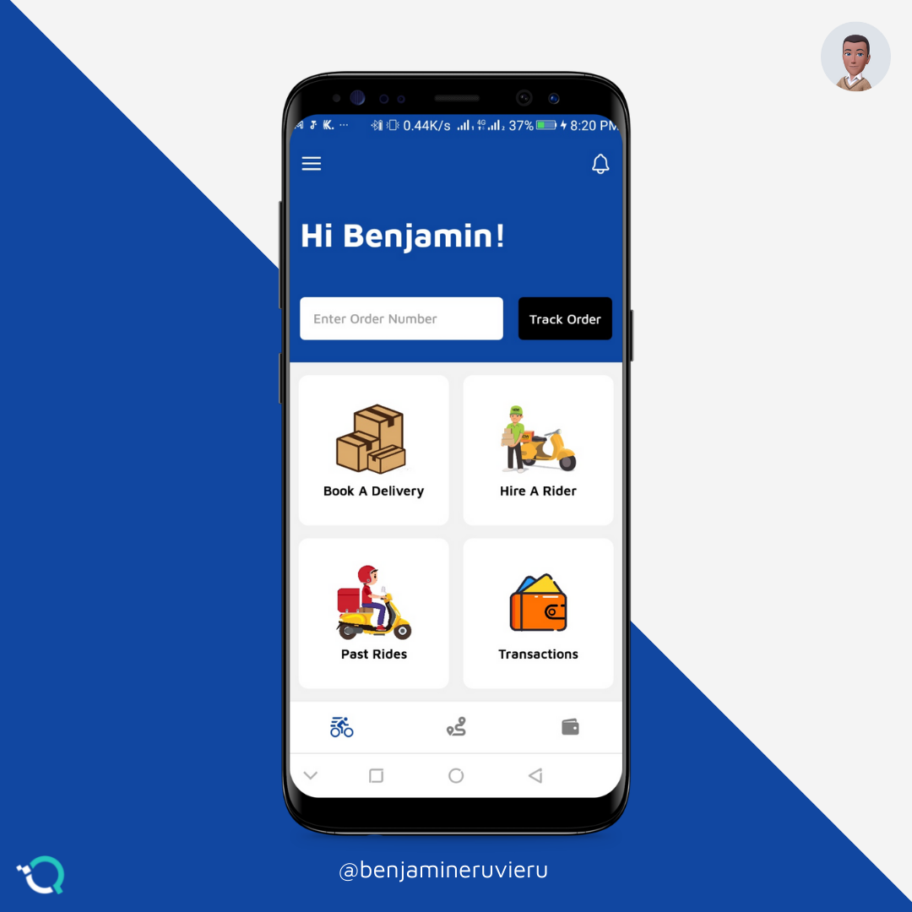
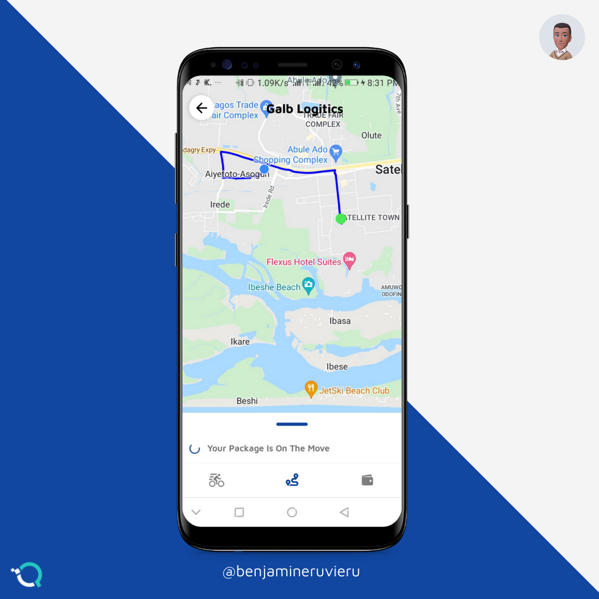
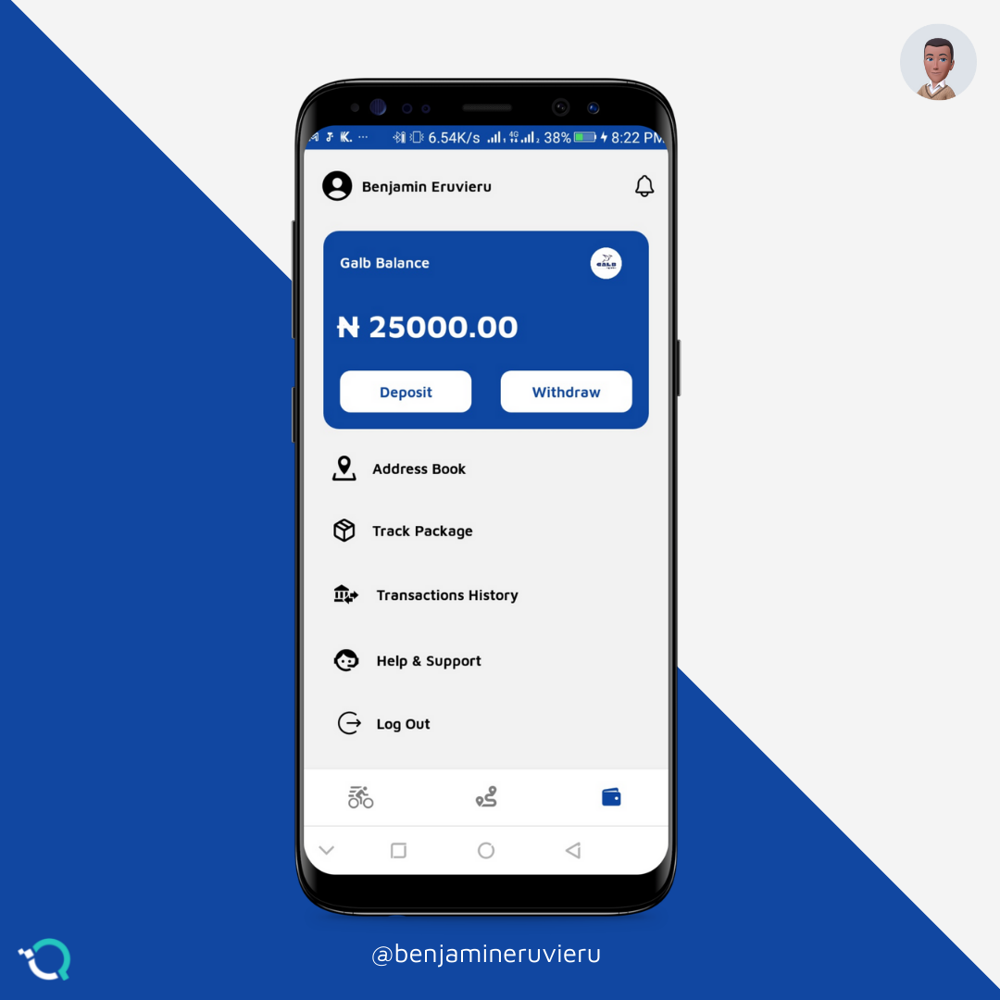

# Galb-Logistics
### Mobile app for a logistics company 

## Features
- Pickup and Delivery Services
- Order Tracking
- Deposits and Withdrawals
- Live Chat to handle issues

## Tech Stack
- React Native
- Firebase
- Flutterwave for handling payments
- Google Maps


## How to build
Clone this repo to your machine: 
```
$ git clone https://github.com/QICSoftwares/Galb-Logistics.git
```
```
$ cd Galb-Logistics
```
Install dependencies: 
```
$ npm install
```
If you are running app on iOS: 
```
$ cd ios
```
```
$ pod install
```
Return to the project main directory: 
```
$ cd ..
```
To run on android: 
```
$ react-native run-android
```
To run on iOS: 
```
$ react-native run-ios
```

## Please Note
> This app is still under production and this is not the finised version <br />
> Additionally, this app has not been tested for the iOS environment.




## Contributing

1.  Create a fork
2.  Create your feature branch: `git checkout -b my-feature`
3.  Commit your changes: `git commit -am 'Add some feature'`
4.  Push to the branch: `git push origin my-new-feature`
5.  Submit a pull request 🚀
<br />

Built by @benjamineruvieru
